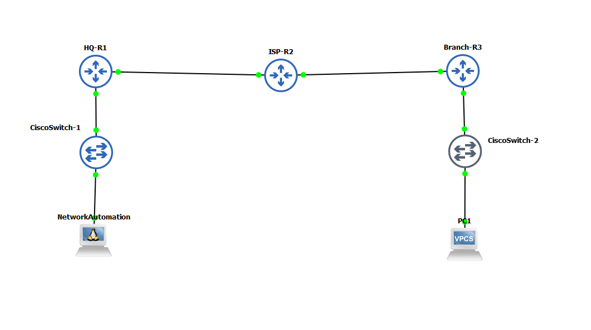

# Cisco CCNP: Site-to-Site GRE Tunneling over eBGP Underlay

Enterprise WAN network connecting HQ and Branch locations over an ISP using eBGP for the underlay, a GRE tunnel for the overlay, and OSPF for internal routing.

---

### IP Addressing and AS Numbers

| Device | Interface | IP Address / Subnet | Purpose | AS Number |
| :--- | :--- | :--- | :--- | :--- |
| **HQ-R1** | Gi0/0 | `198.51.100.1/30` | WAN to ISP | **AS 65100** |
| | Gi0/1 | `10.1.0.1/24` | HQ LAN Gateway | |
| | Loopback0 | `1.1.1.1/32` | Router ID | |
| | **Tunnel1** | `172.16.0.1/30` | GRE Overlay Interface | |
| **ISP-R2** | Gi0/0 | `198.51.100.2/30` | Link to HQ-R1 | **AS 65000** |
| | Gi0/1 | `203.0.113.2/30` | Link to BR-R3 | |
| | Loopback0 | `2.2.2.2/32` | Router ID | |
| **BR-R3** | Gi0/0 | `203.0.113.1/30` | WAN to ISP | **AS 65200** |
| | Gi0/1 | `10.2.0.1/24` | Branch LAN Gateway | |
| | Loopback0 | `3.3.3.3/32` | Router ID | |
| | **Tunnel1** | `172.16.0.2/30` | GRE Overlay Interface | |

---

### Configurations

Full running-config files for all routers can be found in the [Configs](./Configs) folder.