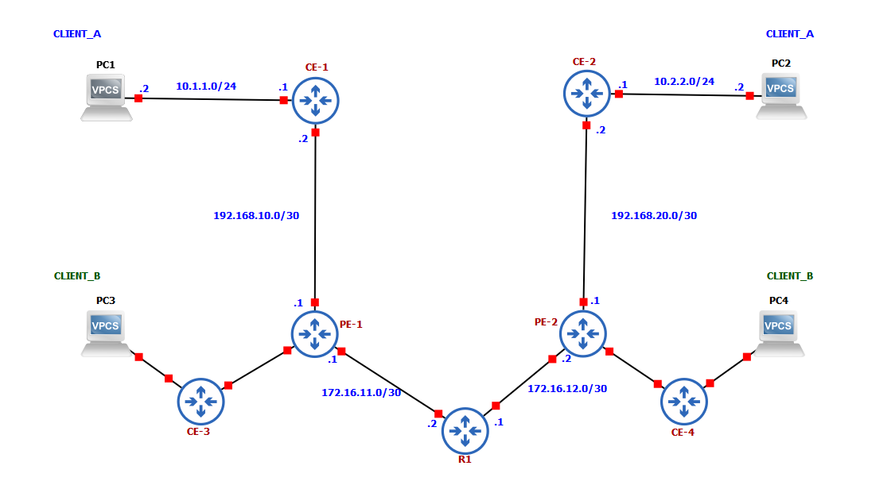

# Cisco CCNP: MPLS L3VPN Multi-Tenancy with Overlapping IP Addresses



Service Provider infrastructure demonstrating MPLS L3VPN Multi-Tenancy. This project showcases how to support multiple isolated enterprise clients (**CLIENT_A** and **CLIENT_B**) using overlapping IPv4 address spaces over a shared MPLS core without routing conflicts.

---

### Key Concepts Demonstrated

* **VRF (Virtual Routing and Forwarding):** Provides logical routing table separation per client on PE routers.
* **Route Distinguisher (RD):** Uniquely prefixes client IPv4 routes to form 96-bit VPNv4 routes (`RD + IPv4`), ensuring uniqueness within MP-BGP.
* **Route Target (RT):** BGP Extended Community used to control import/export policy between VRFs across PE nodes.
* **MP-BGP (Multiprotocol BGP):** Transport control plane used to exchange VPNv4 routes between PE peers.
* **Overlapping IP Support:** Isolated end-to-end communication for identical client LAN subnets (`10.1.1.0/24` and `10.2.2.0/24`).

---

### Network Architecture & Topology

* **Customer Edge (CE):** CE-1 & CE-2 (CLIENT_A), CE-3 & CE-4 (CLIENT_B)
* **Provider Edge (PE):** PE-1, PE-2 (MP-BGP, VRFs, LDP)
* **Provider Core (P):** R1 (OSPF Area 0, LDP Label Switching)

---

### IP Addressing & VRF Design Matrix

| Device | Interface | IP Address / Subnet | Role / VRF Assignment | Notes |
| :--- | :--- | :--- | :--- | :--- |
| **PE-1** | Loopback0 | `1.1.1.1/32` | Core Loopback / BGP ID | MP-BGP Peering Endpoint |
| | Gi0/1 | `172.16.11.1/30` | Core Link to R1 | OSPF Area 0 + LDP |
| | Gi0/0 | `192.168.10.1/30` | **VRF CLIENT_A** | RD `100:1`, RT `100:1` |
| | Gi0/2 | `192.168.10.1/30` | **VRF CLIENT_B** | RD `100:2`, RT `100:2` |
| **PE-2** | Loopback0 | `3.3.3.3/32` | Core Loopback / BGP ID | MP-BGP Peering Endpoint |
| | Gi0/2 | `172.16.12.2/30` | Core Link to R1 | OSPF Area 0 + LDP |
| | Gi0/0 | `192.168.20.1/30` | **VRF CLIENT_A** | RD `100:1`, RT `100:1` |
| | Gi0/1 | `192.168.20.1/30` | **VRF CLIENT_B** | RD `100:2`, RT `100:2` |
| **R1 (P)**| Loopback0 | `2.2.2.2/32` | Core Loopback | OSPF Router ID |
| | Gi0/1 | `172.16.11.2/30` | Core Link to PE-1 | OSPF Area 0 + LDP |
| | Gi0/2 | `172.16.12.1/30` | Core Link to PE-2 | OSPF Area 0 + LDP |
| **CE-1** | Gi0/0 | `192.168.10.2/30` | CLIENT_A WAN | Gateway: `192.168.10.1` |
| | Gi0/3 | `10.1.1.1/24` | CLIENT_A LAN | PC1 Gateway |
| **CE-2** | Gi0/0 | `192.168.20.2/30` | CLIENT_A WAN | Gateway: `192.168.20.1` |
| | Gi0/3 | `10.2.2.1/24` | CLIENT_A LAN | PC2 Gateway |
| **CE-3** | Gi0/0 | `192.168.10.2/30` | CLIENT_B WAN | Gateway: `192.168.10.1` |
| | Gi0/1 | `10.1.1.1/24` | CLIENT_B LAN | PC3 Gateway |
| **CE-4** | Gi0/0 | `192.168.20.2/30` | CLIENT_B WAN | Gateway: `192.168.20.1` |
| | Gi0/1 | `10.2.2.1/24` | CLIENT_B LAN | PC4 Gateway |

---

### Verification Commands

```text
# Verify MP-BGP VPNv4 Table Separation
PE-1# show bgp vpnv4 unicast all

# Verify Specific VRF Routing Tables
PE-1# show ip route vrf CLIENT_A
PE-1# show ip route vrf CLIENT_B

# End-to-End Connectivity Verification
PC1> ping 10.2.2.1
PC3> ping 10.2.2.1