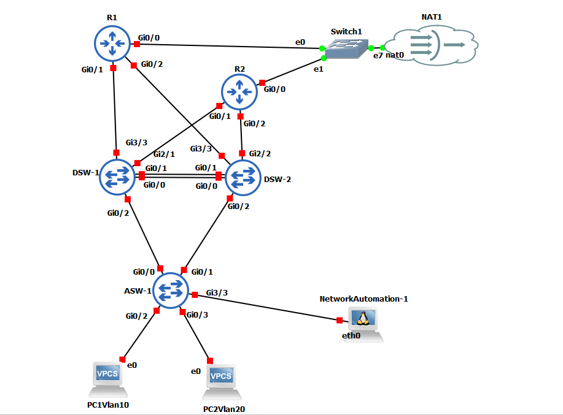

# Cisco CCNP: OSPF over EtherChannel with Network Automation

Enterprise LAN infrastruktura sa Layer 2 i Layer 3 EtherChannel agregacijom linkova, OSPF rutingom i Python skriptom za automatsko pravljenje rezervnih kopija konfiguracija.

---

### Mrežne Uloge i Komponente

* **Core / Edge Routers:** CiscoR1, CiscoR2
* **Distribution Switches (L3):** DSW1, DSW2
* **Access Switch (L2):** ASW1

---

### Configurations & CheatSheet

* [CiscoR1 Config](./CiscoR1.txt)
* [CiscoR2 Config](./CiscoR2.txt)
* [DSW1 Config](./DSW1_final.txt)
* [DSW2 Config](./DSW2_final.txt)
* [ASW1 Config](./ASW1_final_L2.txt)
* [CheatSheet & Notes](./(OSPF%20over%20EtherChannel%20+%20Python%20Backup)CheeatSheet.md)
