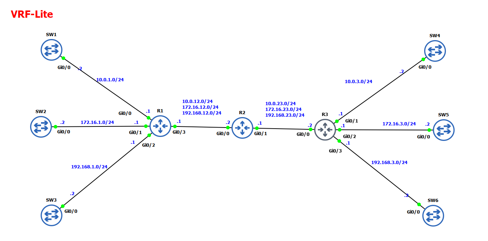

# VRF-Lite with OSPF Setup

This lab demonstrates the implementation of VRF-Lite using OSPF across multi-tenant environments.

## Topology


## Overview
* **VRFs Configured:** RED, GREEN, BLUE
* **Routing Protocol:** OSPF (separate processes per VRF)
* **Inter-Router Encapsulation:** 802.1Q Subinterfaces (.1, .2, .3)
* **Layer 2 Switching:** Pure L2 mode (`no ip routing` with `ip default-gateway`)

## Key Commands
```text
show ip route vrf RED ospf
show ip ospf neighbor vrf RED